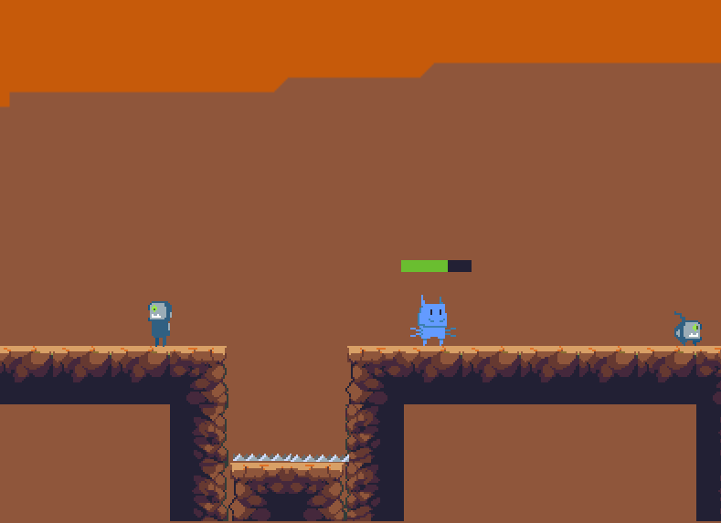

<h1>N-Generations Later</h1>

**First place award winning game at the event "GameJam 2019 - IF Rio Pomba", following the theme "Evolution".**

---

In this game, you take the role of a creature (and it's descendents), in a world that is all yours to explore! Travel through the platforms and watch out for your HP as you face numerous enemies...

---

Disclaimer: This repository contains both the source code for the game and executables for both Windows and Linux systems.

The zip file at the "Games" folder contains both executables. Just extract them to start playing!

This game was made using the Godot Engine. Support them when possible!

This version of the game is completely free! Enjoy it! Also, the game resources are available to you in the src/ folder. The sprites and original pixel arts are included.

The sfx used in this game is available publicly. All the rights to it's respective owners.

---

Next versions will be released as soon as possible! Please stay tuned!
